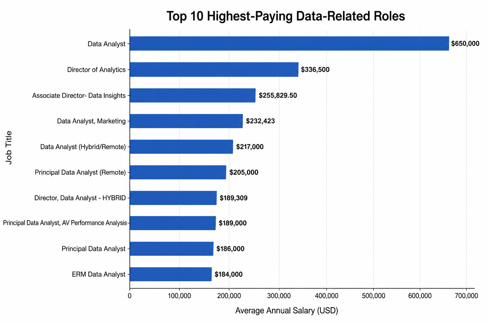
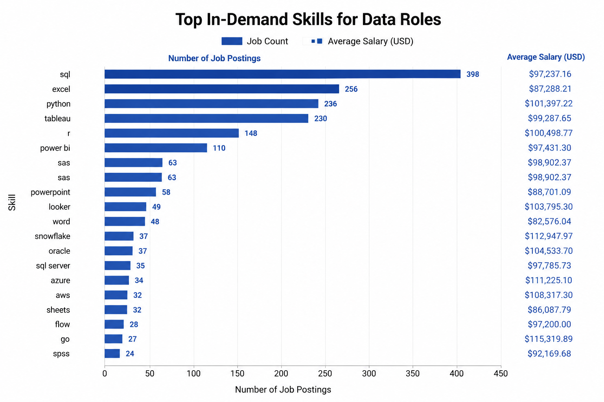

# Introduction
This project analyzes the job market for data related roles, with primary focus on Data Analyst positions. Using real-world job data, it explores in demand skills, top paying roles and required skills to land a high demand role with high salary for a Data Analyst seeking a job.

Find SQL Queries here: [project_sql folder](/project_sql/)

# Background
The [dataset](https://drive.google.com/drive/folders/1moeWYoUtUklJO6NJdWo9OV8zWjRn0rjN) used in this project is sourced from Luke Barousse's Data Analytics Job Market dataset, which contains real-world job posting data, company information, salary estimates, and skill requirements for various data-related roles. By analyzing these datasets, this project aims to uncover market trends, identify the most in-demand skills, and highlight the highest-paying opportunities for aspiring Data Analysts.

### The Questions This Project is Intended to Answer:
1. What are the top paying data analyst jobs?
2. What skills are reqired for the top paying data analyst roles?
3. What are the most in-demand skills for data analyst roles?
4. What are the top 10 paying skills for data analyst roles?
5. What are the most optimal skills to learn?
# Tools Used
- **SQL**: The backbone of the analysis, queried the database to find insights using SQL
- **PostgreSQL**: Database management system for handling the job postings data
- **Visual Studio Code**: Code editor
- **Git & Github**: Version control system to track the SQL scripts and share them across teams
# The Analysis
Each query in this project is focused on investigating specific aspects of the data analyst job market.
Approach to each question:
### 1. Top Paying Data Analyst Jobs
To identify the highest paying roles, i filtered data analyst roles by average yerly salary and location, focusing on remote jobs. This query highlites the high paying roles in the field.
### Code -
```sql
SELECT
    job_id,
    job_title,
    job_location,
    job_schedule_type,
    salary_year_avg,
    job_posted_date,
    name AS company_name
FROM
    job_postings_fact
LEFT JOIN company_dim ON job_postings_fact.company_id = company_dim.company_id
WHERE
    job_title_short = 'Data Analyst'
    AND job_location = 'Anywhere'
    AND salary_year_avg IS NOT NULL
ORDER BY
    salary_year_avg DESC
LIMIT 10;
```
The above query returns a table listing top 10 high paying data analyst jobs.

## Key Takeawayas:
- **Wide Salary Range**: Top 10 paying data analyst roles range in $184,000 to $650,000 indicating significant salary potential in the field.
- **Diverse Employers**: Numerous companies such as Meta, SmartAsset and AT&T are among those offering high salaries, showing a broad interest across various industries.
- **Job Title Variety**: There is a high variety of job titles such as ERM Data Analyst, Director of Analytics, Associate Director - Data Insights and much more within the Data Analytics.


*This chart displays the top 10 highest-paying data-related job postings in the dataset based on average annual salary. The Data Analyst role at Mantys stands out with an exceptionally high salary of $650,000, significantly exceeding all other positions. The results also show that senior and leadership roles such as Director of Analytics and Principal Data Analyst command some of the highest salaries in the data job market*
#### Similar approach has been taken to tackle other aspects of the project.
### Top In-Demand Skills:

*This chart highlights the most in-demand skills for Data Analyst roles based on the number of job postings in the dataset. SQL is the most sought-after skill, appearing in 398 job postings, followed by Excel, Python, and Tableau, indicating that these tools form the core skill set expected by employers.*
*The chart also shows the average salary associated with each skill. While SQL has the highest demand, skills such as Go, Snowflake, Azure, and AWS are linked to higher average salaries, suggesting that specialized technical skills can significantly increase earning potential in the data analytics job market.*
# Conclusion
### Insights
1. **Top Paying Data Analyst Jobs**:The highest-paying position in the dataset is a Data Analyst role at Mantys with a salary of $650,000.
2. **Skills For Top Paying Jobs**: High paying data analyst jobs require proficiency in SQL, suggesting it's one of the most important skill to master for anyone seeking a high paying data analyst job.
3. **Most In Demand Skill**: SQL is also the most in demand skill with high number of job postings.
4. **Skills With High Salaries**: Skills such as SVN and Solidity are associated with highest average salaies.
5. **Optimal Skills for Job Market Value**: SQL leads in demand and offers a high average salary, making it one of the most optimal skills for data analysts to master to maximise their market value.

### Closing Thoughts
This project enhanced my SQL skills and provided valuable insights into the data analyst job market. The insights from the analysis serve as a guide to prioritizing skill development and job search efforts Aspiring data analysts can better position themselves in a competitive job market by mastering high demand and high paying skills. 